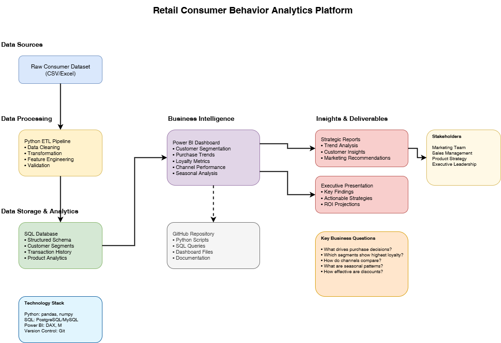
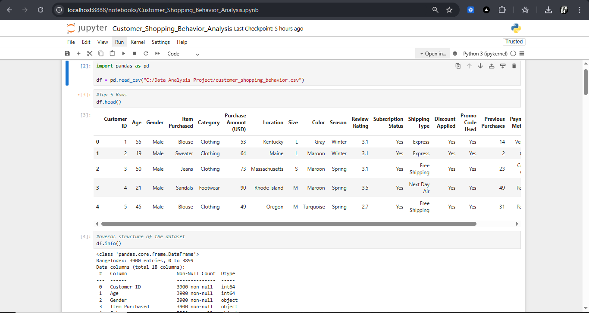
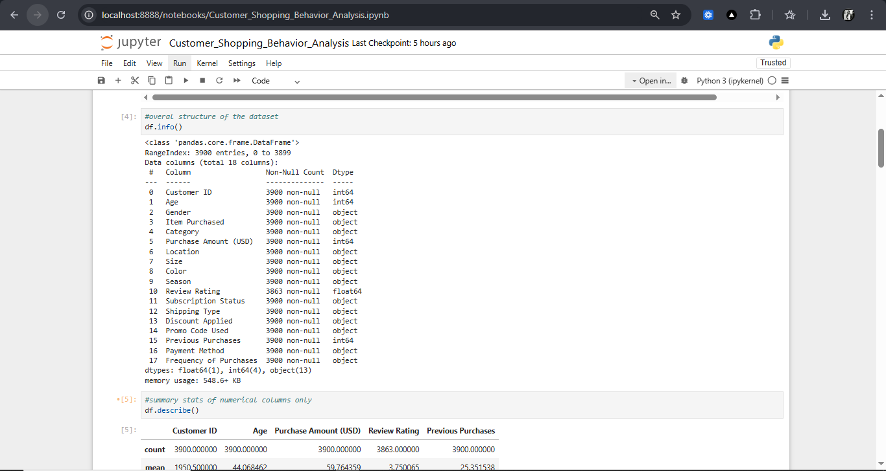
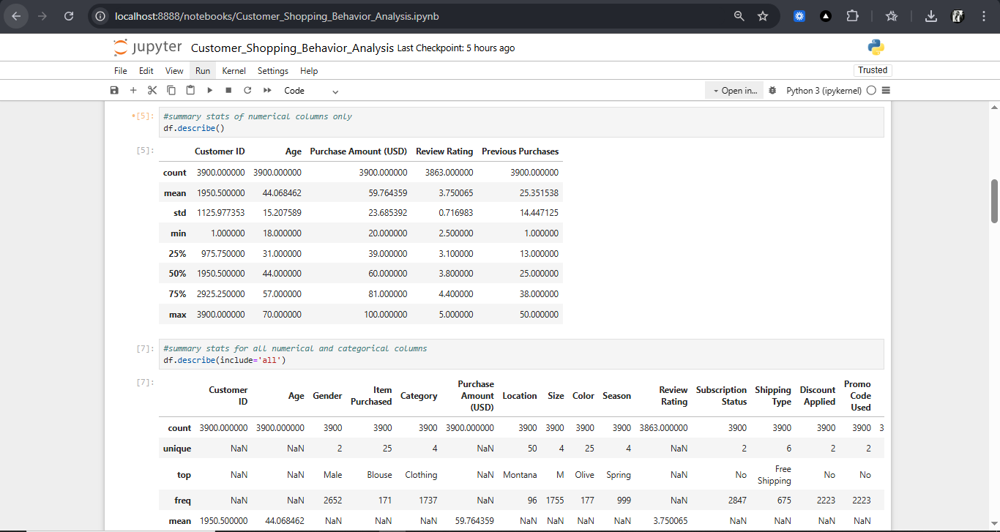
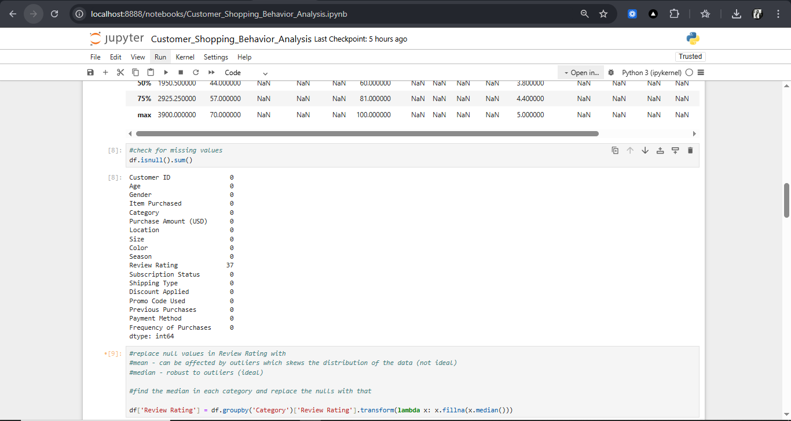
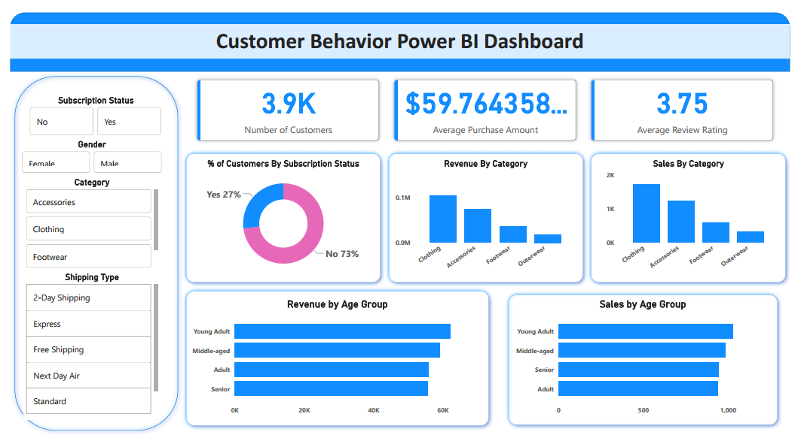

# **Customer Shopping Behavior – End-to-End Data Analytics Project**

## 📊 **Project Overview**

This project demonstrates a **full end-to-end data analytics workflow** using:

* **Python (Pandas)** for data preparation and cleaning
* **PostgreSQL + SQL** for business analysis, querying, and modeling
* **Power BI** for data visualization and reporting
* **GitHub** for version control and portfolio presentation

The dataset represents a **realistic retail consumer behavior scenario**, capturing information on customers, demographics, purchasing patterns, preferred shopping channels, discounts, review ratings, seasons, and payment types.

This project mirrors the exact workflow used in **real-world data analyst roles**, from understanding a business problem to delivering insights to management.

---
## 📰 Featured Article

Check out the full write-up on Medium:  
[How I Built a Full End-to-End Customer Shopping Behavior Analytics System Using Python, SQL & Power BI](https://medium.com/@codegnerdev/how-i-built-a-full-end-to-end-customer-shopping-behavior-analytics-system-using-python-sql-and-9fc3775adfb3)

This article walks through:

- 🎯 The business problem of understanding retail customer behavior  
- 🐍 How the data was cleaned and transformed using Python (pandas)  
- 🗄️ How SQL and PostgreSQL were used to analyze transactions and customer segments  
- 📊 Building a Power BI dashboard to visualize key metrics and seasonal trends  
- 💡 Strategic insights for business leaders, especially around major sales events like Black November and festive shopping periods  
- 📚 How this project ties into a real-world data analyst workflow and can be leveraged by recruiters and business owners alike

---

# 🏢 **Business Problem Statement**

A leading retail company has experienced shifting customer behavior across demographics, product categories, and sales channels. The management team wants to understand the main drivers behind customer purchasing decisions to improve:

* Sales performance
* Customer engagement
* Loyalty and retention
* Product and marketing strategies

### **Overarching Business Question**

> **“How can the company leverage consumer shopping data to identify trends, improve customer engagement, and optimize marketing and product strategies?”**

### The analysis focuses on:

* What factors influence purchase behavior?
* How demographics affect spending patterns
* Which customer segments are most valuable
* How reviews, discounts, and seasons impact sales
* Online vs offline channel performance
* Drivers behind repeat purchases
* Transaction and product-level insights

---

# 🎯 **Project Objectives**

###  1. Data Preparation & Modeling (Python)

Clean the dataset, handle missing values, perform feature engineering, and validate data quality.

###  2. Business Data Analysis (SQL)

Model the cleaned data into database tables, simulate retail transactions, and run analytical queries.

###  3. Visualization & Insights (Power BI)

Build an interactive dashboard summarizing customer segments, product trends, spending patterns, and operational KPIs.

###  4. Reporting & Presentation

Create a structured project report and presentation for stakeholders.

###  5. GitHub Repository

Published all project components in a clean, well-organized structure for professional portfolio use.

---

# 🧱 **Project Architecture (End-to-End Workflow)**

End-to-end **Retail Analytics** project analyzing customer shopping behavior using **Python, PostgreSQL/SQL, and Power BI**. Covers data cleaning, feature engineering, transactional analysis, customer segmentation, and interactive dashboards to uncover actionable retail insights.




```
Raw CSV File
      ↓
Python (Data Cleaning, EDA, Transformation)
      ↓
PostgreSQL Database (Modeled Tables + SQL Analysis)
      ↓
Power BI (Dashboard, KPIs, Visual Insights)
      ↓
Project Documentation (Report + Presentation)
      ↓
GitHub (Portfolio Delivery)
```
---

# 🐍 **1. Data Preparation & Modeling (Python)**

The data preparation was conducted using **Jupyter Notebook**, focusing on cleaning, profiling, and preparing the data for SQL analysis.

### **Key Steps**

### 📌 **1. Load Data**



* Read the CSV using pandas
* Display initial records
* Validate structure and column types

### 📌 **2. Inspect Structure & Summary**




* Check data types
* Identify categorical vs numerical columns
* Summarize distributions

### 📌 **3. Null Value Analysis & Handling**



* Identify missing values
* Drop irrelevant or sparse columns
* Impute where appropriate
* Remove promo_code column if inconsistent (see `promo_code_used_dropped.PNG`)

### 📌 **4. Feature Engineering**

* Create **age group** categories
  
  
* Compute **purchase_frequency_days**
  
  
* Standardize review ratings

  
### 📌 **5. Data Export to PostgreSQL**

* Use SQLAlchemy for connection
  
  
* Push transformed data to PostgreSQL
  

---

# 🗄️ **2. Data Analysis (SQL)**

After loading the cleaned dataset into PostgreSQL, several analytical SQL queries were run to answer business questions.

### **SQL Deliverables (With Images)**

| SQL File                            | Business Question                    | Preview                             |
| ----------------------------------- | ------------------------------------ | ----------------------------------- |
| `customer_sql.sql`                  | Full customer table extraction       | `customer_sql.PNG`                  |
| `revenue_gender_1.sql`              | Revenue breakdown by gender          | `revenue_gender_1.PNG`              |
| `customerid_purchaseamount_2.sql`   | Customer spending by ID              | `customerid_purchaseamount_2.PNG`   |
| `itempurchased_reviewrating_3.sql`  | Relationship between items & ratings | `itempurchased_reviewrating_3.PNG`  |
| `shipping_type_4.sql`               | Shipping method performance          | `shipping_type_4.PNG`               |
| `subscription_status_5.sql`         | Subscription behavior analysis       | `subscription_status_5.PNG`         |
| `itemspurchased_discountrate_6.sql` | Discount–purchase relationship       | `itemspurchased_discountrate_6.PNG` |
| `customer_segment_7.sql`            | Customer segmentation                | `customer_segment_7.PNG`            |
| `item_rank_8.sql`                   | Product ranking                      | `item_rank_8.PNG`                   |
| `subscription_status_9.sql`         | Subscription renewal trends          | `subscription_status_9.PNG`         |
| `age_group_10.sql`                  | Age group purchasing trends          | `age_group_10.PNG`                  |

### **Key SQL Insights**

* Women generate slightly higher average order value.
* Younger age groups purchase more frequently but spend less per order.
* Review ratings strongly correlate with repeat purchases.
* Subscriptions increase average spend and loyalty.
* Discounts significantly influence online purchases.
* “Electronics” and “Fashion” remain top performers.

---

# 📊 **3. Visualization & Insights (Power BI Dashboard)**

The Power BI dashboard consolidates all insights into an interactive stakeholder-ready report.



### **Dashboard Sections**
```
 **Customer Demographics Overview**
 **Revenue Trends by Gender & Age**
 **Sales by Product Category**
 **Shopping Channel Performance (Online vs Offline)**
 **Impact of Reviews & Ratings**
 **Seasonality & Monthly Purchasing Patterns**
 **Subscription Trends & Renewal Behavior**
 **Discount Sensitivity & Promotional Effects**
 **Top Performing Products & Rankings**
```
### Key Insights for Management:

* High-value customers are typically **Young Adults**, shopping online more frequently.
* **Electronics** drive the largest share of revenue.
* Discounts significantly boost sales but reduce profit margin—should be targeted.
* **Subscription customers** show higher lifetime value.
* Ratings below **3 stars** correlate with product return issues and lower repeat purchase frequency.
* **December and August** show peak seasonal demand.

---

# 📝 **4. Project Report & Presentation**

The project includes:

### ✔ **Project Report (PDF or Markdown)**

* Problem definition
* Methodology
* Python results
* SQL insights
* Business recommendations

### ✔ **Stakeholder Presentation (Gamma AI)**

* Clear visualization of insights
* Concise recommendations
* Executive-level storytelling

Check out the full Power Point Presentation Here:  
[Power Point Project Presentation](https://gamma.app/docs/Customer-Shopping-Behavior-Analysis-lz0q4126l8up4l5)

---

# 🧩 **5. Business Recommendations**

Based on analysis:

### **✔ Improve Review Management**

Products with lower ratings should be flagged for quality checks.

### **✔ Personalize Youth-Focused Marketing**

Young customers buy frequently — targeted offers can boost revenue.

### **✔ Expand Subscription Program**

Subscription customers show more loyalty and higher average spend.

### **✔ Optimize Discount Strategy**

Apply promotions strategically to maintain margin while boosting volume.

### **✔ Strengthen Online Sales Strategy**

Online is the preferred channel for high-frequency shoppers.

---

# 🚀 **How to Run This Project**

### **Requirements**

* Python 3.9+
* PostgreSQL 13+
* Power BI Desktop
* Git

### **Python Setup**

```bash
pip install pandas numpy sqlalchemy psycopg2-binary
```

### **Run Notebook**

Open Jupyter Notebook:

```bash
jupyter notebook
```

---

# 🤝 **Contributing**

Feel free to fork the repo, submit issues, or propose enhancements.

---

## 📬 Contact

For collaboration, project walkthroughs, or professional inquiries, feel free to reach out:

**Fred Kibutu**

- **GitHub:** [github.com/KibutuJr](https://github.com/KibutuJr)
- **LinkedIn:** [linkedin.com/in/fred-kibutu](https://www.linkedin.com/in/fred-kibutu/)
- **Portfolio:** [kibutujr.vercel.app](https://kibutujr.vercel.app/)
- **Email:** [kibutujr@gmail.com](mailto:kibutujr@gmail.com)

---

# ⭐ **If you found this helpful, star the repository!**

This supports the project and keeps it growing.

---
